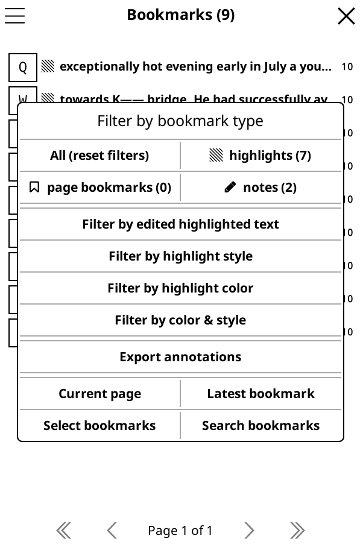

# 🏷️ Bookmark Menu Modifications !!
A KOReader patch that adds the option to filter by highlight colors, or to filter by both highlight colors and highlight style at the same time. 

<div align="center"> 
    
</div>
<center>(This example is taken from my KOReader emulator.)</center>

## 🤖 Technologies
- `Lua`

## 💡 Features
- Can filter highlights based on color. This includes notes of that highlighted color too (can be changed to only highlight colors and not notes if wanted).
- Can filter highlights based color and style simultaneously. For example, "red underlines" or "pink strikethroughs".
- Updated filtering logic to filter from all annotations instead of what is currently displayed on the bookmark screen.

## 📚 Why?
There was no way to see highlight colors from the bookmark screen. So I added a way to filter it. Originally, I was going to change the icons to match the color, but that proved much harder, and this current method makes a lot more sense, instead of just having all the different colored highlights scattered amongst themselves.

I changed the filtering logic too because previously if you filter by ***Underline*** then ***Lighten***, it will filter from the current *table* which would only be ***Underline*** bookmarks. This means it will be impossible to get a ***Lighten*** text from a *table* of only ***Underline***, even if you have existing ***Lighten*** bookmarks. Previously you would have to reset filters each time, but this patch handles the resetting too.

## 🚀 How to use?
### 1. Download the patch
Start with downloading the patch `2-bookmark-highlight-modifications.lua`

### 2. Add the patch
Add the patch to your existing patch folder.

### 3. Edit OR Add the `readerbookmark.lua`
Simply replace you current `readerbookmark.lua` with the one from this folder.

**HOWEVER**

If you are tech savy, you can edit your current `readerbookmark.lua` (I would advise this if you have already made changes to it, as downloading my uploaded copy will most likely revert the changes you have made in the past. **Trust me its very easy! I'll guide you through it**.)

## Editting `readerbookmark.lua` (optional)
### 1. Control-f to find:
```bash
table.insert(buttons, {
    {
        text = _("Filter by highlight style"),
        callback = function()
            UIManager:close(bm_dialog)
            bookmark:filterByHighlightStyle()
        end,
    },
})
```
### 2. Copy and paste:
Right below where you found these lines of code, copy and paste this:
```bash
table.insert(buttons, {
    {
        text = _("Filter by highlight color"),
        callback = function()
            UIManager:close(bm_dialog)
            bookmark:filterByHighlightColor()
        end,
    },
})
table.insert(buttons, {
    {
        text = _("Filter by color & style"),
        callback = function()
            UIManager:close(bm_dialog)
            bookmark.ui.highlight:showHighlightColorFilterDialog(function(selected_color)
                bookmark.ui.highlight:showHighlightStyleDialog(function(selected_drawer)
                    bookmark:filterByColorAndStyle(selected_drawer, selected_color)
                end)
            end)
        end,
    },
})
```
All three should now be aligned in a row.
### 3. Control-f and add:
Control-f to find these lines of code. It should look the exact same, minus the last line. Simply add the last line: `self.show_color_only = nil`
```bash
bm_menu.close_callback = function()
    UIManager:close(self.bookmark_menu)
    self.bookmark_menu = nil
    self.match_table = nil
    self.show_edited_only = nil
    self.show_drawer_only = nil
    self.show_color_only = nil
end
```


