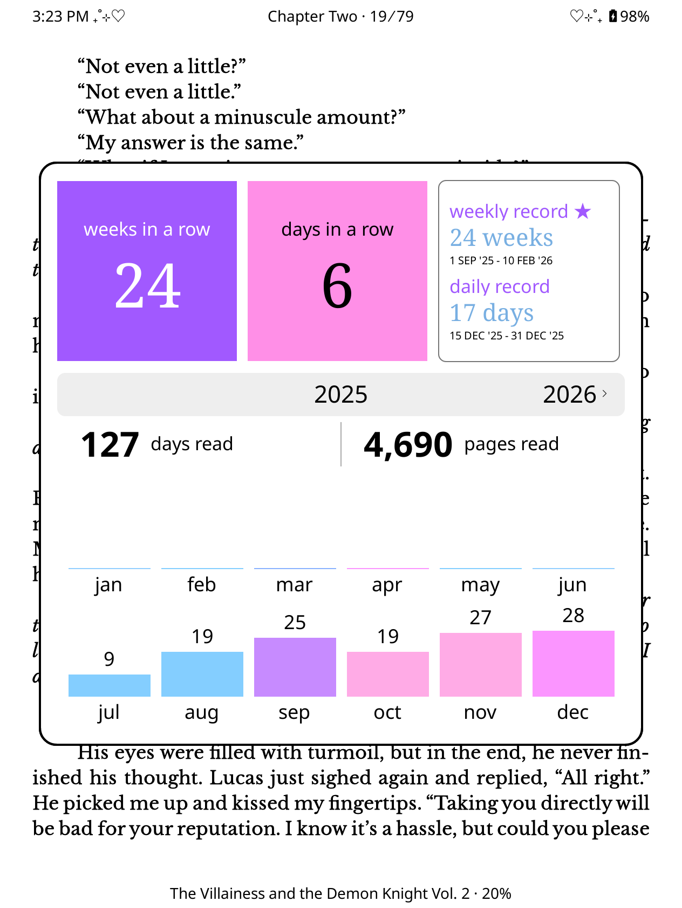
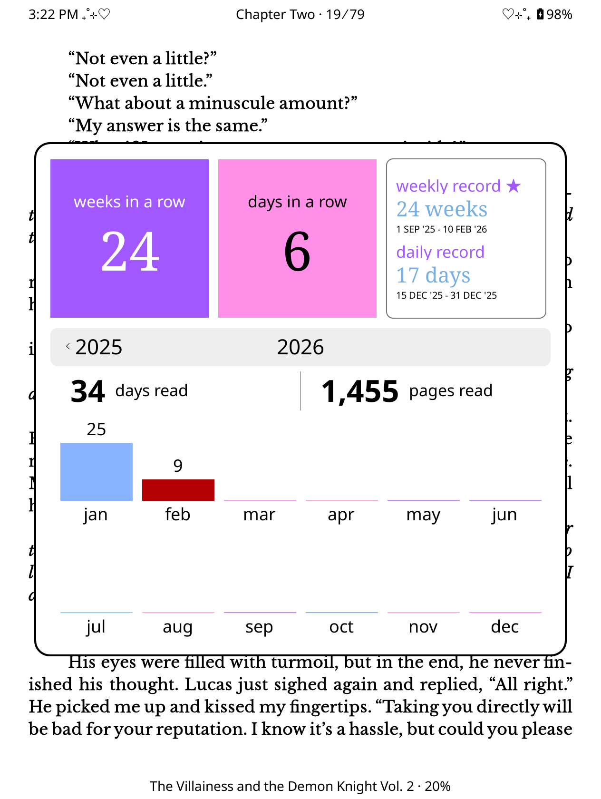

# 🔴 Colored Reading Insights Pop-Up

All credits to [zenixlabs](https://github.com/zenixlabs/koreader-frankenpatches-public/tree/main) and [quanganhdo](https://github.com/quanganhdo/koreader-user-patches) for this amazing reader insights pop-up patch. This version of the patch contains some minor adjustments, primarily adding adjustable color. 

<div align="center">
    
    
</div>


## 🔋 Technologies
- `Lua`

## 🎮 Features
- Adds customizable color to the "Current Streak" Boxes/Widgets
- Adds customizable colored text to the "Best Streak" Box/Widget
- Adds customizable color to the monthly bars
    - Currently randomnizes through a random selection of colors
    - A different color for "Current" month
- Removes `0` from appearing for months with `0` days read
- Patches `linewidget.lua` to be compatible with color

## ❓ Why?
The patch itself was already aesthetically pleasing on its own, but I wanted to add some more color so it can pop. After skimming through the code, I decided to share the modified patch publicly, incase others may want the same. I kept the code pretty simple so users can freely change the colors as they pleased. 

I also removed the `0` from appearing. This was so the insights pop-up has a slightly cleaner look and to help with the color "ghosting" that was appearing behind the colored bars.

`linewidget.lua` was patched within this patch so it can accept RGB values, because it was originally only grayscale. 

## 🤠 How to use?
### 1. Download the patch
Download the patch `2-reading-insights-popup-colored.lua`

### 2. Add the patch
Add the patch to your existing patch folder.

## ✏️ How to edit?
There are 2 main sections you can edit, the first being the colors controlling the 3 widgets at the top of the pop-up, and the second being the colors for the bars.

### Widget Colors:
Locate: (line 211)
```bash
InsightColors = {
    daysColor = "#ff8fe7",     --controls weeks in a row box color         
    weeksColor = "#a159ff",    --controls days in a row box color
    recordColor = "#a159ff",   --currently same as above, but controls the "weekly record" and "daily record" text color (can be set to different color if desired)
    valueTextColor = "#78afe2", --controls the color of the value/text in streak box
    currMonthColor = "#b40000", --controls bar color for current month
}
```
You can change any of the hex values to any color you decide. 

### Bar Colors:
Locate: (line 991)
```bash
local BAR_COLORS_RGB = {                        --predefined set of bar colors to be randomnized from. can be modified, added, or removed,  as desired
        Blitbuffer.colorFromString("#fb95ff"), 
        Blitbuffer.colorFromString("#84ceff"),
        Blitbuffer.colorFromString("#ffabe6"),
        Blitbuffer.colorFromString("#89b2ff"), 
        Blitbuffer.colorFromString("#c78bff"), 
        Blitbuffer.colorFromString("#92ceff"), 
    }
```
You can change, remove, or add any hex values to this list. The code randomly chooses from this selection. You can have as much or as little as you'd like but the code is *completely* random so it is possible for the same color to appear multiple times. 

`Note:` These colors are reloaded each time, even when switching years/screens. This means the randomnization will continue to randomnize it. It's more fun this way :)