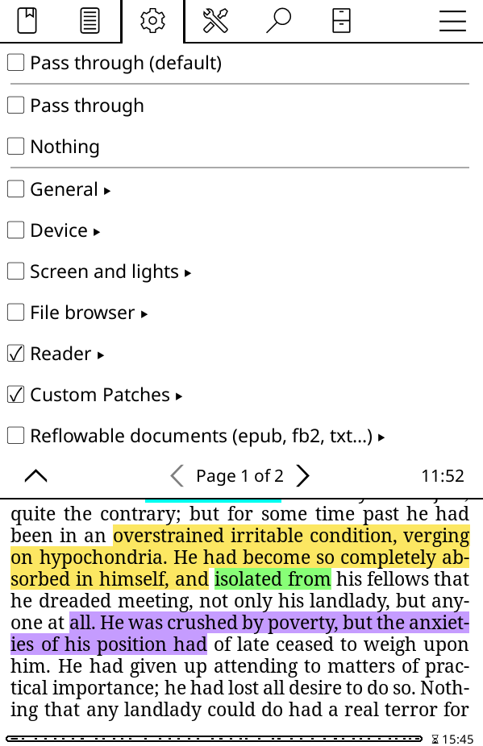
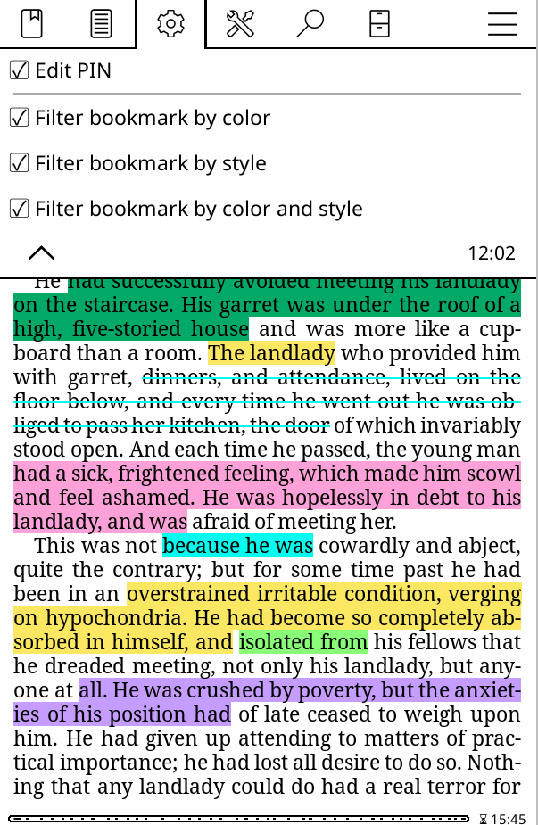

# Folder For Custom Patch Buttons
A KOReader patch (mostly for fellow developers or those who understand how to edit code) that stores all custom buttons into a folder for gestures to use. This patch extends the existing gesture menu to have a "Custom Patches" folder. Essentially a shared integration point for other user patches. 

<div align="center"> 
    
    
</div>
<p style="text-align: center; font-style: italic;"> Left image shows the folder created by this patch, labeled "Custom Patches", the right image shows whats inside. Right images showcases the patch working with a lockpin plugin created by another user and with the bookmark filter patch I created. </p>

## 🤖 Technologies
- `Lua`

## 💡 Features
- Creates a "Custom Patches" folder, acting as a central hub where other user patches can store it's buttons to be used by gestures.
- Centralized, making user patch buttons/functions easier to find when binding to a gesture
- Doesn't edit `dispatcher.lua`, allowing the patch to *most likely* survive new updates. Also easier for users to just download and begin using instead of needing to edit various lines of code

## How?
My patch creates a global `_G._customPatchButtons` table, that can be accessed from other patches. This table is the table that stores custom patch buttons to be used as gestures. It has a function `_G.registerCustomPatchButton` that takes in parameters `id`, `title`, `callback`, and `separator`, and registers them (this will be explained in further detail below). It also overrides a portion of `addSubMenu` to create the "Custom Patches" section/folder underneath the "Reader" section and stores the custom buttons into this. This is because `dispatcher.lua` creates mostly local tables, so for an expandable table that others can use, I needed to create a global table that can be easily accessed, viewed, and editted.

## 📚 Why?
I was trying to register an action into KOReader from one of my other patches. I managed to implement and add this feature into the gesture manager screen under the reader tab. But I did so by editing `dispatcher.lua`, and this means the feature would be limited to only those who were able to edit it too. It also means that the patch would no longer work after updating. Using only `Dispatcher:registerAction` I was able to again input the feature under the reader section but was not able to organize it in a position that I liked, the features would always go to the end because of how `Dispatcher:registerAction` functioned.

So I decided to create a new section "Custom Patches" that can not only store the features from my other patch, but would also be exapandable and work with other user patches as long as they made *some* changes. 

## 🚀 How to use?
### 1. Download the patch
Simply download the patch `2-gesture-patches-folder.lua`

### 2. Add the patch
Add the patch to your existing patch folder. 

### 3. Utilize a compatible patch with it
If another patch utilizes this patch correctly it should work. If no patch in your existing patch folder utilizes this patch, you will simply have the "Custom Patches" folder but it will be empty.

If you are a fellow developer or if you are relatively tech savy and want an existing patch to work with this one, please refer to below!

## How to use with other user patches?
### 1. Implement the functionality (event handler)
Dispatcher only sends an event name. So something needs to listen for that event and perform the action.

There are 2 main ways to do this:
 - Adding a method to an existing widget/class 
 - Register a function using UIManager:registerEvent("EventName", callback) *I am not familiar with this method, you might have to look into it further yourself if doing this way*
___
 For the first method, in reference to to my bookmarks patch, I have a function:
 ```bash
 function ReaderBookmark:filterByHighlightColor()
 ```
 This function essentially filters the Bookmarks by a chosen highlight color. To allow this function to work with dispatcher, I can do something like this inside the Bookmark patch:
 ```bash
 function ReaderBookmark:onFilterByHighlightColor()
    self:onShowBookmark()
    UIManager:scheduleIn(0.1, function()
        self:filterByHighlightColor()
    end)
end
```
Essentially this sets up the event handler so that this current patch, `2-gesture-patches-folder.lua`, can use. 

Here is another example using [m1khal3v's pinlock plugin](https://github.com/m1khal3v/koreader-pinlock):
```bash
function PinLock:onShowSetPinDialog()
    self:showSetPinDialog()
end
```
There already existing a `PinLock:showSetPinDialog` that was a button that, when clicked, displayed a dialog to set a new pin. All I added was the code above `PinLock:onShowSetPinDialog` anywhere in the plugin and this creates the event handler. 

### 2. Register the Dispatcher action
`Dispatcher:registerAction` tells KOReader about the action (id, category, event, title). This is what appears in gesture menus and what gesture bindings use.

**Important:** registerAction stores the action under a specific section using something like `reader=true`. This will store the action under the reader section. Using something like `screen=true` will store the action under the "Screen and lights" section. However, we can implement a sort of backup to either: place in "Custom Patches" section if possible, and if not, place under "Reader" section. I'll explain this below.
```bash
Dispatcher:registerAction("filter_bookmark_color", {
    category = "none",
    event    = "FilterByHighlightColor",
    title    = _("Filter by highlight color"),
})
```
This is essentially how to register an action so that KOReader sees it. The very first `"filter_bookmark_color"`, this is the unique ID. It can be named anything as long as it is unique from any other patches and/or unique from any existing action in `dispatcher.lua`. Category is usually just "none" for event calls, but I recommend checking with the commented out information on `dispatcher.lua` for more information. Event is the name of the actual event we created earlier, minus the "on". For example the event handler above is `onFilterByHighlightColor` and `onShowSetPinDialog`. The events when registering these two actions would be `FilterByHighlightColor` and `ShowSetPinDialog` respectively. Please note the differences in capitalization too. 

To implement the backup I mentioned, you need to check to see if this patch exists:
```bash
local useCustomFolder = _G.registerCustomPatchButton ~= nil
```
This line of code should be in the same area as your `registerAction`, usually within a `UIManager:scheduleIn(0.1, function() )`. This line of code eseentially checks to see if the global table exists, if the table exists, it means the patch exists. We can then add this to out previous: 
```bash
Dispatcher:registerAction("filter_bookmark_color", {
    category = "none",
    event    = "FilterByHighlightColor",
    title    = _("Filter by highlight color"),
    reader   = not useCustomFolder,  -- only auto-add to Reader if custom folder not present
})
```
The last line utilizes the boolean from earlier to set `reader = true` if the patch doesnt exists, and if it does exists then sets `reader = false`. This is good practice as it allows for a backup if the patch is missing and if the patch exists store is ONLY in "Custom Patches".

### 3. Adding the registered action/button into "Custom Patches" section/folder
```bash
if _G.registerCustomPatchButton then
    _G.registerCustomPatchButton("filter_bookmark_color", _("Filter bookmark by color"), function()
        UIManager:sendEvent(Event:new("FilterByHighlightColor"))
    end)

    _G.registerCustomPatchButton("filter_bookmark_style", _("Filter bookmark by style"), function()
        UIManager:sendEvent(Event:new("FilterByHighlightStyle"))
    end)
    
    _G.registerCustomPatchButton("filter_bookmark_color_and_style", _("Filter bookmark by color and style"), function()
        UIManager:sendEvent(Event:new("FilterByHighlightColorAndStyle"))
    end, true)
end
```
Essentially what is happening here is the bookmark patch is checking to see if the global table from the "Custom Patches" patch exists. If it does, it inserts/registers it into the table. 

Heres an example of what I added into the pinlock plugin mentioned above:
```bash
_G.registerCustomPatchButton("pinlock_edit_pin", _("Edit PIN"), function()
    UIManager:sendEvent(Event:new("ShowSetPinDialog"))
end, true) --true adds a separator below the button
```

I know everything above might be confusing to a lot of people. I am not the greatest at explaining what I know minimal of. If you have any questions please reach out and I'll try my best to respond/help. What helps a lot for me is examples, so please look at my Bookmark filters patch to see how the code is implemented and try to understand what it does from there. 
