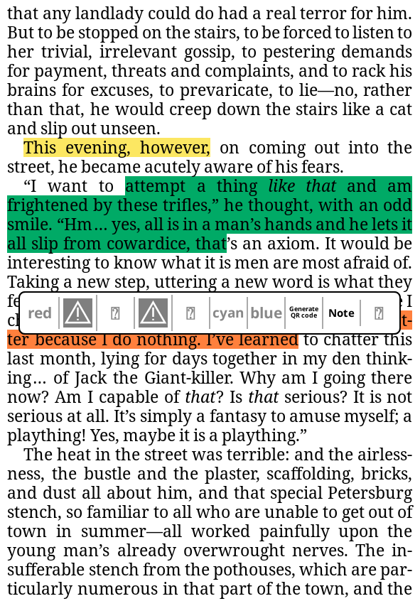
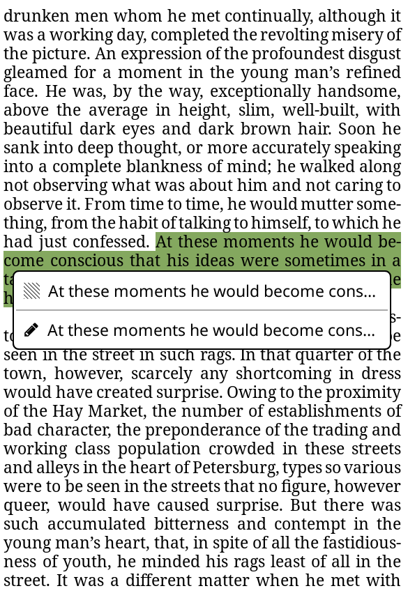

# Highlight Menu Modifications
Made some simple edits to [VeeBui's](https://github.com/VeeBui/koReader-highlight-menu-patch) popular, `2-highlight-menu-modifications.lua`. The changes include more buttons, `.png` icons for each button, and fixed some button logic.


## Technologies
- `Lua`

## Features / Changes
- When highlighting, can choose any color of existing colors (customizable).
- Still includes original buttons, such as `Select`, `Copy`, `Note`, etc.
- `addNote` now checks for an existing note to edit, and if none is found, creates a new note.
- Now takes in `index` of the highlight, to check to see if it exists. If it does, the user can edit the highlight from this screen and it will be updated, otherwise it creates a new highlight and saves it.


## Why?
Previously, the dialog that pops up when initially highlighting, only creates a new highlight and/or new note. However, this screen can be returned to using the `. . .` button that pops up when selecting an existing highlight. But because this popup only handled, *new* highlights/notes the highlights and note buttons(if they exist) would be grayed out. This was a very niche issue but I changed it at the request of my sister. The example below showcases the problem better:

<div align="center"> 
    
    
</div>

- Left Image: *(ignore my missing `.png`, this was taken on my emulator and I never saved the `.png`)*
  - To recreate: highlight text -> click on the highlighted text -> click `. . .` -> the colors should be grayed out. 
  - **In this modified patch**, this should be fixed and the user should be able to edit the color from this menu.

- Right Image:
  - To recreate: highlight text -> click on the highlighted text -> click `. . .` -> click note and write a note and save -> click the highlight -> the highlight contains overlapping highlights, both in color and also in what is saved. There should be two highlights, one that is only the highlight which is seen in the example, indicated with the square made by diaganol lines, and the other that contains the note, indicated with the pencil icon.
  - (The user was also able to stack notes repeatedly if they tried, but I will not go into this. Just know that the patch fixed it)
  - **In this modified patch**, this should be fixed and instead of creating a new note, it edits an existing highlight and adds a note to that instead of making a new "annotation" each time. 

## 🚀 How to use?
### 1. Download the patch
Start with downloading the patch `2-highlight-menu-modifications.lua`

### 2. Add the patch
Add the patch to your existing patch folder. 

### 3. Edit `readerhighlight.lua`
This can be found in `koreader/frontend/apps/reader/modules`.  

### 4. CTRL+F to find & replace:
```bash
local columns = 2
```
Replace with:
```bash
local columns = 10
```
If u have never edited this or recently updated, it will most likely be "2". You can change this number to whatever you'd like. It affects the max amount of buttons appearing in each row. 

If for example you had "9" buttons total, and `local columns = 2` Then each row will have a maximum of "2" buttons. The last row will have "1" button which will scale to fill the whole width of the popup. This same effect can be seen in the top image. We have "10" color buttons, hence our code is `local columns = 10`, and the remaining "7" buttons auto fill the second row, because the first is already at its max. 